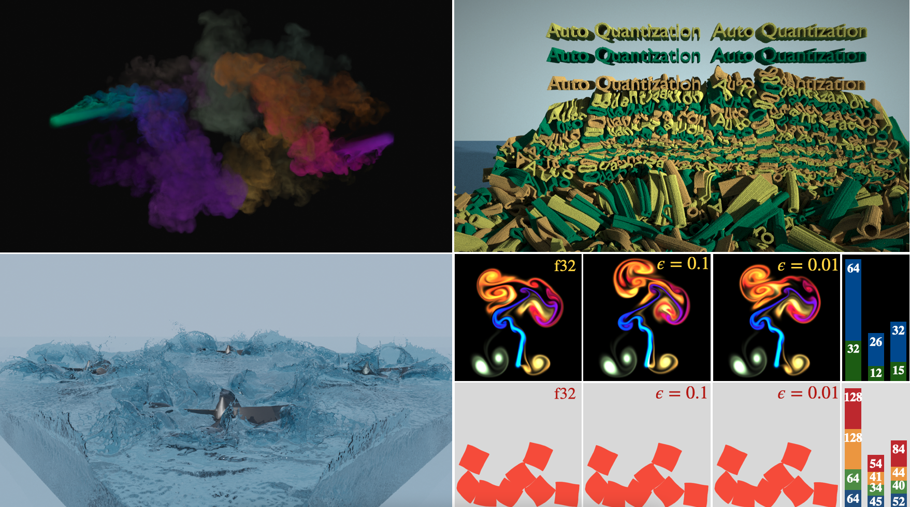

# Automatic Quantization for Physics-Based Simulation (SIGGRAPH 2022)
Jiafeng Liu*, Haoyang Shi*, Siyuan Zhang, Yin Yang, Chongyang Ma and Weiwei Xu


## Automatically gernerate quantization schemes for quantized simulations
### Abstract
Quantization has proven effective in high-resolution and large-scale simulations, which benefit from bit-level memory saving. However, identifying a quantization scheme that meets the requirement of both precision and memory efficiency requires trial and error. In this paper, we propose a novel framework to allow users to obtain a quantization scheme by simply specifying either an error bound or a memory compression rate. Based on the error propagation theory, our method takes advantage of auto-diff to estimate the contributions of each quantization operation to the total error. We formulate the task as a constrained optimization problem, which can be efficiently solved with analytical formulas derived for the linearized objective function. Our workflow extends the Taichi compiler and introduces dithering to improve the precision of quantized simulations. We demonstrate the generality and efficiency of our method via several challenging examples of physics-based simulation, which achieves up to 2.5x memory compression without noticeable degradation of visual quality in the results.


## To reproduce our results

### Prerequisites
1. Our customized Taichi compiler in the `taichi_submission` folder
1. cmake
2. python3.7 or newer
3. numpy
4. scipy
5. plyfile 
### Build our compiler

Our framework is based on Taichi Programming Language(v0.8.4). The compiler code is in folder `taichi_submission` and our main modification to the compiler to implement the `bit_pack` data structure is in `taichi_submission/taichi/codegen/codegen_llvm_quant.cpp`.

```
cd taichi_submission
mkdir build
cd build
cmake ..
make -j8
```
### Reproduce the experiments

See Readme document in `mpm_exps` for the MPM experiments.

The experiments of Eulerian smoke simulation will be released soon.

